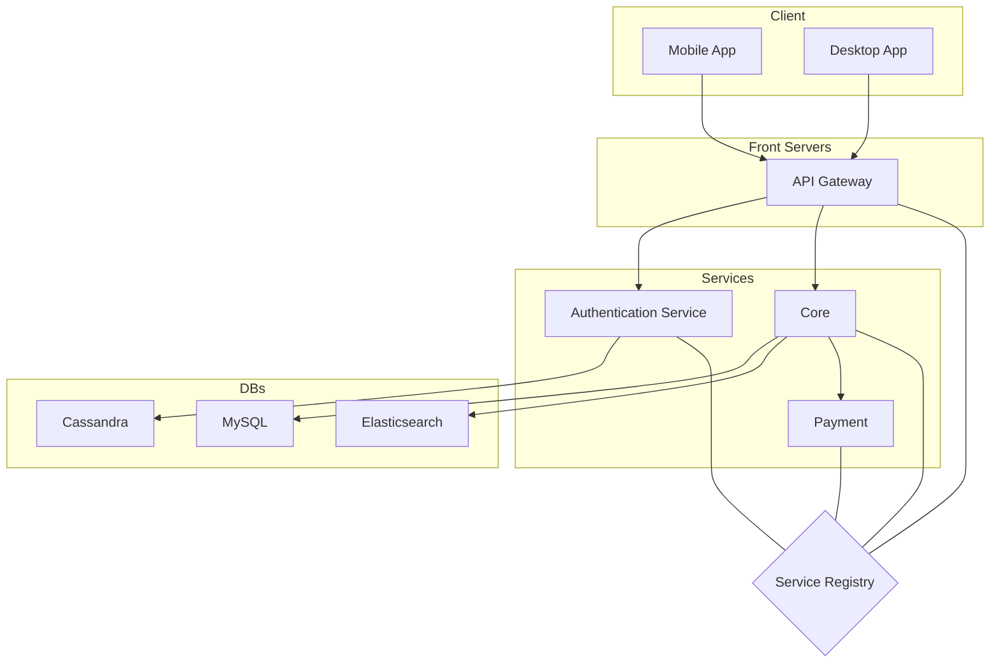

# Infrastructure

Here is a description of our infrastructure.

> You can use a [Mermaid's Flowchart](https://mermaidjs.github.io/flowchart.html) to describe your infrastructure. Here is an example.

