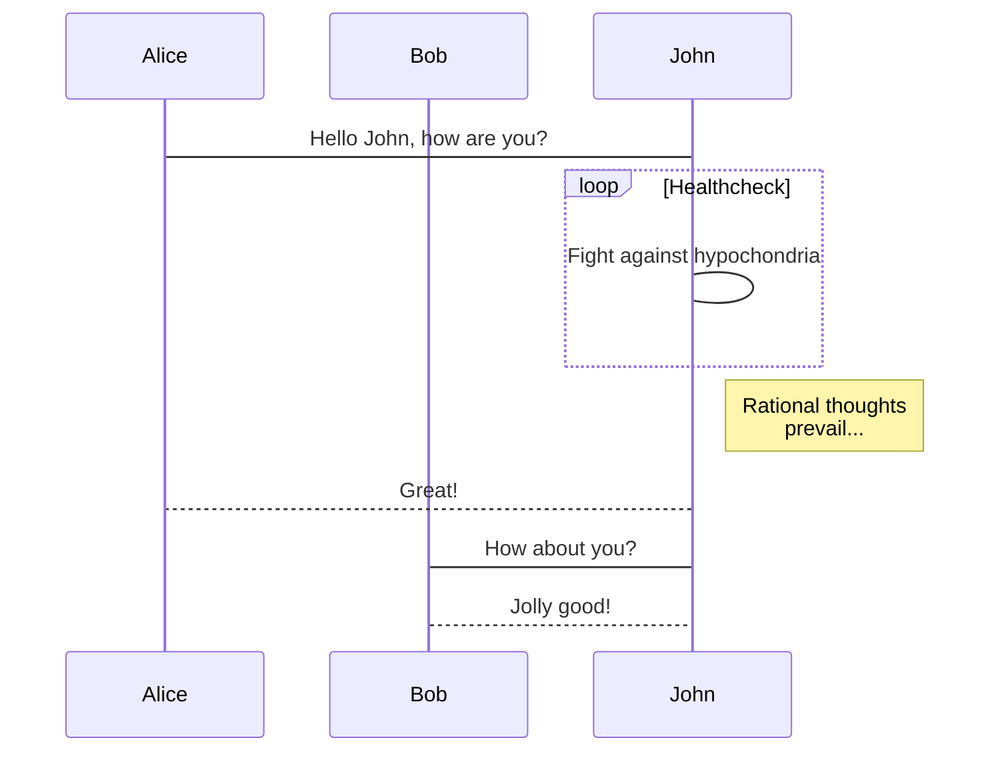

# Example story

> This is an example of domain story, to illustrate how you can tell your stories.
> A way to do it, illustrated here, could be to tell the story in plain words, and then to show it with a sequence diagram.

We have 3 actors, Alice, Bob and John.

Alice asks to John how he is. John fights against hypochondria, and once rational thoughts prevail, he answers he's fine. He then asks the same question to Bob, who answers he's fine too.

